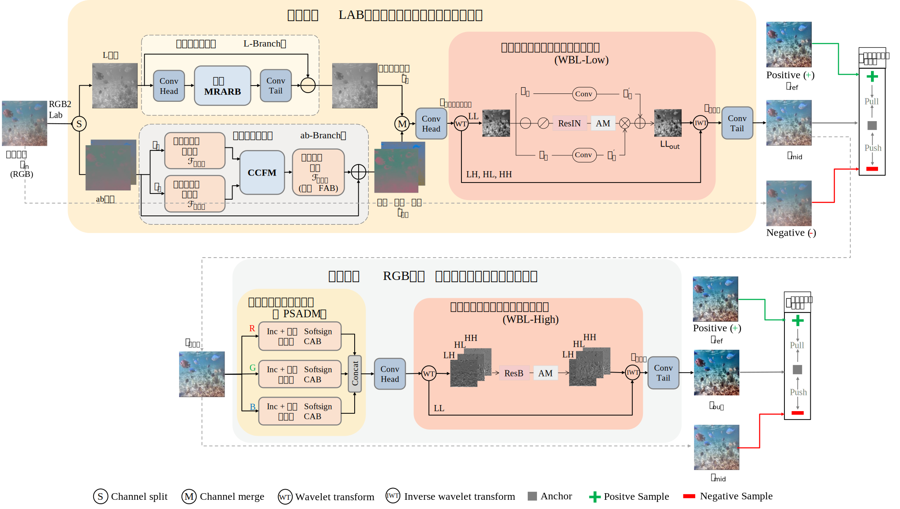

# CDP-UIE: Progressive Underwater Image Enhancement via Cross-Domain Decoupling

PyTorch implementation for progressive underwater image enhancement based on cross-domain decoupling.

---

## Overall Framework

  

  <em>Overall framework of the proposed progressive underwater image enhancement method.</em>

---

## Overview

Underwater images usually suffer from wavelength-dependent color distortion, non-uniform illumination attenuation, and detail blurring caused by scattering. Existing enhancement methods often perform end-to-end restoration in a single color space, which may lead to feature coupling between illumination and color, as well as optimization conflicts between global color correction and local detail recovery.

To address these issues, this repository implements a progressive underwater image enhancement framework based on cross-domain decoupling. The overall method follows a **"decouple first, then progressively restore"** pipeline:

- **Stage 1** performs global color correction in the **LAB color space** and low-frequency sub-bands.
- **Stage 2** performs local detail recovery in the **RGB color space** and high-frequency sub-bands.

In addition, this repository also includes the single-stage baseline method based on **illumination-color decoupling in the LAB color space**, which serves as the foundation of the progressive framework.

---

## Method Summary

### 1. Single-stage baseline in LAB color space

The baseline model decouples luminance and chromaticity in the LAB color space and processes them in separate branches:

- **MRARB**: Multi-scale Receptive-field Aggregation Residual Block for non-uniform illumination compensation in the luminance branch.
- **CCFM**: Cross-branch Competitive Fusion Module for chromaticity correction in the color branch.

This design improves illumination compensation and color restoration by reducing interference between brightness and chromaticity features.

### 2. Dual-stage progressive enhancement framework

The full model further introduces cross-color-space collaboration and frequency-band divide-and-conquer:

- **Stage 1: Global color correction**
  - Operates in the **LAB color space**
  - Focuses on **low-frequency** degradation
  - Uses **WBL-Low** to suppress underwater global degradation style

- **Stage 2: Local detail recovery**
  - Operates in the **RGB color space**
  - Focuses on **high-frequency** detail restoration
  - Uses **PSADM** to enhance compensation for severely attenuated channels
  - Uses **WBL-High** to improve texture and edge recovery

- **Training objective**
  - Robust reconstruction loss
  - Wavelet-domain collaborative constraints
  - Hierarchical dynamic contrastive learning
